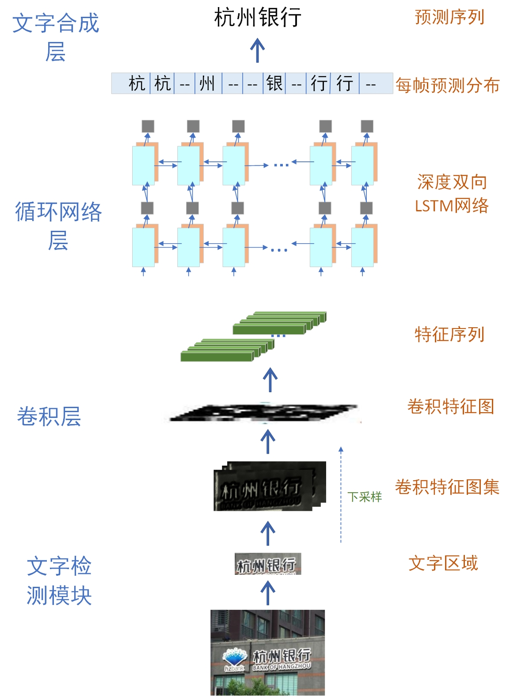

# 基于深度学习的企业实体识别

## 摘要

​		随着深度学习技术的发展，文字识别与自然语言处理近年来受到广泛关注。结合文字识别与自然语言处理技术解决传统方法无法处理的问题，成为企业提高自身竞争力的重要利器。

## 需求分析

### 背景及研究意义

​		实体识别技术在布局各类证件、通用文字识别等相关领域都有着重要应用前景，我们相信实体识别技术将会支持更多应用场景，满足更多用户的需求。例如，通过拍照扫描等方式，提供身份信息的快速自动录入体验，以提高边检/酒店/旅游/公共安全以及电商等行业领域的工作效率；自然场景实体识别可以捕获现实中多种场景下的文字，可有效支持虚拟现实、人机交互、图像检索、无人驾驶、车牌识别、工业自动化等领域中广泛的应用。综上，实体识别技术有着广泛的应用前景。

### 作品简介

​		企业实体识别主要应用在我们目前业务系统中的查证功能。查证功能的主要作用是将用户拍摄的店铺照片经过OCR识别后进行店铺名称的提取，然后通过店铺名称查询证照库，获取该店铺办理过的所有证照信息，方便用户进一步了解该店铺。在日常应用中，例如外出就餐时利用我们的系统随手拍摄要就餐的饭店门脸，系统会自动检测该饭店证照是否齐全以及所办证照的详细信息，方便用户做出就餐决策。

​		参赛者可以用附件提供的50张图片作为测试数据，提取出文字信息后汇总进Excel作为交付文件，此外附件还包括一个txt文件，文件中每行表示每张图片的标准输出。

### 特色描述

我们的作品相对于现有的企业实体识别技术主要有以下主要特色：

- 更快的收敛速度

  传统的系统往往需要较大的训练数据集才可以得到较好的测试精度，这就十分不利于提升中小型企业在市场中的竞争力，我们通过进行前置文字转移技术来使得作品有了更快的收敛速度，更利于中小型企业的应用。

- 更快的相应速度

  相对于传统的OCR算法在文字识别时更注重查全率不同，我们的系统更关注一张图片中的主要内容，也即是较大的商标LOGO，而不用去关注那些与企业名称识别无关的部分。

- 更巧妙的算法带来更准确的识别结果

  市面上现有的算法几乎都是完全基于深度学习的判断，这样不仅让系统的运行速度降低，更重要的是这样的做法在复杂环境下会降低准确率，我们小组在深度学习的基础上增加了商标面积权重，这样的作法基于人的想法：人往往会将那些期望的景物放在图片最显眼的位置。

### 应用前景

​		企业实体识别技术在布局各类证件、通用文字识别等相关领域都有着重要应用前景，我们相信未来企业实体识别技术将会支持更多应用场景，满足更多用户的需求。例如，通过拍照扫描等方式，提供身份信息的快速自动录入体验，以提高边检/酒店/旅游/公共安全以及电商等行业领域的工作效率；自然场景企业实体识别可以捕获现实中多种场景下的文字，可有效支持虚拟现实、人机交互、图像检索、无人驾驶、车牌识别、工业自动化等领域中广泛的应用。综上，我们的项目有着广泛的应用前景。

### 需求描述

#### 功能性需求

1. 程序能够自动读取图片所在的文件夹路径。
2. 从图片文件夹路径中顺序取出图片进行识别。
3. 能够尽可能识别出图片中的所有文字，接着从文字中精确识别商铺名称。
4. 最终的识别结果以一份汇总的Excel交付

#### 非功能性需求

1. 程序源码要求结构清晰。
2. 建议但不强求使用人工智能领域深度学习技术进行实现。
3. 使用GPU(图形处理器)加速计算。

### 实验条件

1. 操作系统使用Windows10。
2. 开发语言使用Python3。
3. 使用Pytorch实现模型训练。

## 概要设计

#### 架构设计

​		为了使您可以更直观，方便的了解本系统的架构模式，我们绘制了如下的系统架构图：


#### 使用的技术

- 文字检测
- 文字识别
- 命名实体识别

#### 算法交互架构

​		本项目有三个主要的模块即：文字检测，文字识别与命名实体识别，其中：

1. 文字检测与文字识别将直接通过数据流进行交互，并且这两项算法由于已经较为稳定，它们被封装在一个Docker容器中。
2. 文字识别与命名实体识别之间将通过套接字进行交互，这也是为了后期可能的分布式处理做准备。
3. 在我们优化过程中也对图片进行了加工，这时图片将直接通过读写文件的方式进行交互。

## 详细设计

我们根据架构设计的结果绘制出了如下的数据流图


即：

1. 用户打开软件，输入期望识别的图片所在文件夹
2. 程序会根据用户输入的文件路径读入相应的图片
3. 程序会根据图片的大小情况进行压缩
4. 图片会被交给文字检测模块，检测后输出文字所在区域坐标
5. 文字识别模块接收到文字区域信息自动识别区域内的文字信息
6. 系统将识别出的文字信息交给自然语言处理模块
7. 自然处理模块通过中文文本语义识别和面积加权判断出最可能企业实体名称并传递给主函数
8. 主函数接收到自然语言处理模块返回的数据，将数据按照格式要求写入excel文件以及一个txt文件，同时向用户返回成功的消息

其中：

- 文字检测模块使用EAST算法
- 文字识别模块使用CRNN+CTC算法
- 自然语言处理模块使用Aho-Corasick算法

​       整个项目过程中python代码需严格按照Google开源项目风格指南完成，除此之外要特别注重变量的可读性命名，所有代码都尽可能有详尽的注释。Java代码需严格遵守阿里巴巴Java开发手册要求进行编码。

​		除此之外还要注意文档的书写以及文件目录结构的组织，以增强代码的可重用性，可扩展性以及可维护性。

## 文字检测模块

### EAST算法

#### 核心思想

- 提出了两段式的文本检测方法，FCN+NMS，消除多过程造成的中间误差累计，减少了检测时间
- 模型可以进行单词级别检测，又可以进行文本行检测，检测的形状可以是任意形状的四边形也可以是普通的四边形
- 采用了`Locality-Aware NMS`的预测框过滤

网络结构如下所示


#### Pipeline

- 先用一个通用的网络(论文中采用的是PVAnet，实际在使用的时候可以采用VGG16，Resnet等)作为base net ，用于特征提取

> 此处对PAVnet进行一些说明，PAVnet主要是对VGG进行了改进并应用于目标检测任务，主要针对FasterRcnn的基础网络进行了改进，包含`mCReLU,Inception,Hyper-feature`各个结构
>
> 
>
> 在论文总的基础网络用的是`PVAnet`的基础网络，具体参数如下所示
>
> 
>
> 对于mCReLU结构和Inception结构如下所示
>
> 

- 基于上述主干特征提取网络，抽取不同层的`featuremap`（它们的尺寸分别是inuput-image的132,116,18,14132,116,18,14，这样可以得到不同尺度的特征图，这样做的目的是解决文本行尺度变换剧烈的问题，ealy-stage可用于预测小的文本行(较大的特征图)，late-stage可用于预测大的文本行(较小的特征图)。
- 特征合并层，将抽取的特征进行merge．这里合并的规则采用了Unet的方法，合并规则：从特征提取网络的顶部特征按照相应的规则向上进行合并，不断增大featuremap的尺寸。
- 网络输出层，包含文本得分和文本形状．根据不同文本形状(可分为RBOX和QUAD，对于RROX预测的是当前点距离gtbox的四个边的距离以及gtbox的相对图像的x正方向的角度θ，也就是总共为5个值分别对应着$(d1,d2,d3,d4,θ)$，而对于QUAD来说预测对应的gtbox的四个交点的坐标，一共8个值)，对于RBOX对应的示意图如下所示


​		图中的di对应的是当前点到gt的距离，知道了一个固定点到矩形的四条边的距离，就可以的知道这个矩形所在的位置和大小，即确定这个矩形。

$$
\begin{array}{|c|c|c|}
\hline \text { 几何图形 } & \text { 边数 } & \text { 描述 } \\
\hline \hline \text { AABB } & 4 & \mathbf{G}=\mathbf{R}=\left\{d_{i} \mid i \in\{1,2,3,4\}\right\} \\
\hline \text { RBOX } & 5 & \mathbf{G}=\{\mathbf{R}, \theta\} \\
\hline\text { QUAD } & 8 & \mathbf{G}=\mathbf{Q}=\left\{\left(\Delta x_{i}, \Delta y_{i}\right) \mid i \in\{1,2,3,4\}\right\} \\
\hline
\end{array}
$$
​		可以看出，对于RBOX输出5个预测值，而QUAD输出8个预测值。

​		对于层g和h的计算方式如图中公式所示。

- 对于g为uppooling层，每次操作将featuremap放大到原来的2倍，主要进行特征图的上采样，论文中采取的双线性插值的方法进行上采样，没有使用反卷积的方式，减少了模型的计算量但是有可能降低模型的表达能力
- 上采样之后的featuremap和下采样同样尺寸的f层进行merge并使用conv1x1降低合并后的模型的通道数
- 之后使用conv3x3卷积，输出该阶段的featuremap
- 上述操作重复3次最终模型输出的通道数为32

### Loss计算

总的损失包含分类损失和回归损失，即

​				$L=LS+λgLgL=LS+λgLg$

分类损失论文中使用的是平衡交叉熵损失

​				$LS= balanced−xent(Y˙,Y)
=−βYlogY˙−(1−β)(1−Y˙)(log(1−Y˙))
​    whereβ=1−∑y∈Yy|Y|$

其中Y˙为预测值，Y为label值。相比普通的交叉熵损失，平衡交叉熵损失对正负样本进行了平衡。

对于LgLg损失，由于在对于RBOX信息中包含的是5个预测值即$(d1,d2,d3,d4,θ)(d1,d2,d3,d4,θ)$，那么就可以得到损失为

​				$Lg=LAABB+λθLθL$

​			$where AABB=−logIoU(R˙,R∗)=−log|R˙∩R∗||R˙∪R∗|$

​				$Lθ=1−cos(θ˙−θ∗)$

对于IOU损失的计算是，论文中对交集区域面积的计算方式为

​				$wi=min(d˙2,d∗2)+min(d˙4,d∗4)$

​				$hi=min(d˙1,d∗1)+min(d˙3,d∗3)$

接着进行特征图合并之后进行预测输出，也就是针对不同的box形式输出5个或者8个预测值。

进行测试的识别中间结果如下：


在复杂条件下的文字检测能力


## 文字识别模块

### CRNN+CTC

#### CRNN基本网络结构



整个CRNN网络可以分为三个部分：

- Convolutional Layers

这里的卷积层就是一个普通的CNN网络，用于提取输入图像的Convolutional feature maps，即将大小为 ![[公式]](https://www.zhihu.com/equation?tex=%2832%2C+100%2C3%29) 的图像转换为 ![[公式]](https://www.zhihu.com/equation?tex=%281%2C25%2C512%29) 大小的卷积特征矩阵。

CRNN算法输入100*32归一化高度的词条图像，基于7层CNN（普遍使用VGG16）提取特征图，把特征图按列切分（Map-to-Sequence），每一列的512维特征，输入到两层各256单元的双向LSTM进行分类。在训练过程中，通过CTC损失函数的指导，实现字符位置与类标的近似软对齐。

CNN代码

```python
#CNN part
    inputs = Input(shape=(picture_height, picture_width, 1), name='pic_inputs') # H×W×1 32*256*1
    x = Conv2D(64, (3,3), strides=(1,1), padding="same", kernel_initializer=initializer, use_bias=True, name='conv2d_1')(inputs) # 32*256*64 
    x = BatchNormalization(name="BN_1")(x)
    x = Activation("relu", name="relu_1")(x)
    x = MaxPooling2D(pool_size=(2,2), strides=2, padding='valid', name='maxpl_1')(x) # 16*128*64

    x = Conv2D(128, (3,3), strides=(1,1), padding="same", kernel_initializer=initializer, use_bias=True, name='conv2d_2')(x) # 16*128*128
    x = BatchNormalization(name="BN_2")(x)
    x = Activation("relu", name="relu_2")(x)
    x = MaxPooling2D(pool_size=(2,2), strides=2, padding='valid', name='maxpl_2')(x) # 8*64*128

    #卷积两次以后池化
    x = Conv2D(256, (3,3), strides=(1,1), padding="same", kernel_initializer=initializer, use_bias=True, name='conv2d_3')(x)  # 8*64*256
    x = BatchNormalization(name="BN_3")(x)
    x = Activation("relu", name="relu_3")(x)
    x = Conv2D(256, (3,3), strides=(1,1), padding="same", kernel_initializer=initializer, use_bias=True, name='conv2d_4')(x) # 8*64*256
    x = BatchNormalization(name="BN_4")(x)
    x = Activation("relu", name="relu_4")(x)
    x = MaxPooling2D(pool_size=(2,1), strides=(2,1), name='maxpl_3')(x) # 4*64*256
    # 卷积两次以后池化
    x = Conv2D(512, (3,3), strides=(1,1), padding="same", kernel_initializer=initializer, use_bias=True, name='conv2d_5')(x) # 4*64*512
    x = BatchNormalization(axis=-1, name='BN_5')(x)
    x = Activation("relu", name='relu_5')(x)
    x = Conv2D(512, (3,3), strides=(1,1), padding="same", kernel_initializer=initializer, use_bias=True, name='conv2d_6')(x) # 4*64*512
    x = BatchNormalization(axis=-1, name='BN_6')(x)
    x = Activation("relu", name='relu_6')(x)
    x = MaxPooling2D(pool_size=(2,1), strides=(2,1), name='maxpl_4')(x) # 2*64*512
    #卷积一层
    x = Conv2D(512, (2,2), strides=(1,1), padding='same', activation='relu', kernel_initializer=initializer, use_bias=True, name='conv2d_7')(x) # 2*64*512
    x = BatchNormalization(name="BN_7")(x)
    x = Activation("relu", name="relu_7")(x)
    conv_otput = MaxPooling2D(pool_size=(2, 1), name="conv_output")(x) # 1*64*512
    
    # Map2Sequence part
    x = Permute((2, 3, 1), name='permute')(conv_otput) # 64*512*1
    rnn_input = TimeDistributed(Flatten(), name='for_flatten_by_time')(x) # 64*512
```

- Recurrent Layers

这里的循环网络层是一个深层双向LSTM网络，在卷积特征的基础上继续提取文字序列特征。对RNN不了解的读者，建议参考：

所谓深层RNN网络，是指超过两层的RNN网络。

由于CNN输出的Feature map是![[公式]](https://www.zhihu.com/equation?tex=%281%2C25%2C512%29)大小，所以对于RNN最大时间长度 ![[公式]](https://www.zhihu.com/equation?tex=T%3D25) （即有25个时间输入，每个输入 ![[公式]](https://www.zhihu.com/equation?tex=x_t) 列向量有 ![[公式]](https://www.zhihu.com/equation?tex=D%3D512) ）。

RNN代码

```python
 # RNN part，双向LSTM
    y = Bidirectional(LSTM(256, kernel_initializer=initializer, return_sequences=True), merge_mode='sum', name='LSTM_1')(rnn_input) # 64*512
    y = BatchNormalization(name='BN_8')(y)
    y = Bidirectional(LSTM(256, kernel_initializer=initializer, return_sequences=True), name='LSTM_2')(y) # 64*512
```

这里用到了keras中的Bidirectional函数构建双向LSTM，这里要说一下深层BLSTM


​		首先我们在输入层之上。套上一层双向LSTM层。相比RNN，能够更有效地处理句子中单词间的长距离影响。而双向LSTM就是在隐层同一时候有一个正向LSTM和反向LSTM，正向LSTM捕获了上文的特征信息，而反向LSTM捕获了下文的特征信息，这样相对单向LSTM来说能够捕获很多其它的特征信息。所以通常情况下双向LSTM表现比单向LSTM或者单向RNN要好。上图输入层之上的那个BLSTM层就是这个第一层双向LSTM层神经网络。

​		我们能够把神经网络的深度不断拓展，就是在第一层BLSTM基础上。再叠加一层BLSTM，叠加方法就是把每一个输入相应的BLSTM层的输出作为下一层BLSTM神经网络层相应节点的输入，由于两者序列长度是一一相应的，所以非常好叠加这两层神经网络。假设你觉得有必要，全然能够如此不断叠加更深一层的BLSTM来构造多层深度的BLSTM神经网络。

- CTC

​        CTC在训练时更多的考虑是将可能映射（去重、去空）出的标签包含的路径的概率之和来最大化(CTC假设每个时间片的输出是相互独立的，则路径的后验概率是每个时间片概率的累积)，那么在输出时根据给定输入搜索概率最大的路径时就更可能搜索出能映射到正确结果的路径。且搜索时考虑了“多对一”的情况，进一步增加了解码出正确结果的可能性。所以我理解的CTC其实并不在意是否学习好了对齐这个过程，对齐只是寻找结果的一个手段，而CTC只在乎是结果，CTC是可以不需要对齐而能解码得到正确结果的方法。至少CTC在训练时不是对齐，但CTC在解码时，特别是搜索解码时，参与解码的部分合法路径可能是“比较整齐的界限分明的多对一对齐”。

CTC代码实现方式：

这里用的keras，keras中ctc_batch_cost函数可以实现CTC：

> 这里输入：args = (y_true, y_pred, pred_length, label_length) y_true, y_pred分别是预测的标签和真实的标签 shape分别是（batch_size，max_label_length)和(batch_size, time_steps, num_categories) perd_length, label_length分别是保存了每一个样本所对应的预测标签长度和真实标签长度 shape分别是（batch_size, 1)和(batch_size, 1) 输出：batch_cost 每一个样本所对应的loss shape是（batch_size, 1)

测试：

测试图片


结果：


## 自然语言处理模块

***注：此模块为Java实现模块，在使用时请确保您的电脑上已经安装了jdk环境并正确的配置了Java环境变量***

### Aho-Corasick算法

​      Aho-Corasick算法简称AC算法，通过将模式串预处理为确定有限状态自动机，扫描文本一遍就能结束。其复杂度为O(n)，即与模式串的数量和长度无关。

#### 思想 

​      自动机按照文本字符顺序，接受字符，并发生状态转移。这些状态缓存了“按照字符转移成功（但不是模式串的结尾）”、“按照字符转移成功（是模式串的结尾）”、“按照字符转移失败”三种情况下的跳转与输出情况，因而降低了复杂度。

#### 基本构造

AC算法中有三个核心函数，分别是：

- success; 成功转移到另一个状态（也称goto表或success表）
- failure; 不可顺着字符串跳转的话，则跳转到一个特定的节点（也称failure表），从根节点到这个特定的节点的路径恰好是失败前的文本的一部分。
- emits; 命中一个模式串（也称output表）

#### 匹配过程

自动机从根节点0出发

1. 首先尝试按success表转移（图中实线）。按照文本的指示转移，也就是接收一个u。此时success表中并没有相应路线，转移失败。
2. 失败了则按照failure表回去（图中虚线）。按照文本指示，这次接收一个s，转移到状态3。
3. 成功了继续按success表转移，直到失败跳转步骤2，或者遇到output表中标明的“可输出状态”（图中红色状态）。此时输出匹配到的模式串，然后将此状态视作普通的状态继续转移。

​        算法高效之处在于，当自动机接受了“ushe”之后，再接受一个r会导致无法按照success表转移，此时自动机会聪明地按照failure表转移到2号状态，并经过几次转移后输出“hers”。来到2号状态的路不止一条，从根节点一路往下，“h→e”也可以到达。而这个“he”恰好是“ushe”的结尾，状态机就仿佛是压根就没失败过（没有接受r），也没有接受过中间的字符“us”，直接就从初始状态按照“he”的路径走过来一样（到达同一节点，状态完全相同）。

#### 构造过程

##### goto表

很简单，了解一点trie树知识的话就能一眼看穿，goto表就是一棵trie树。把上图的虚线去掉，实线部分就是一棵trie树了。


##### output表

output表也很简单，与trie树里面代表这个节点是否是单词结尾的结构很像。不过trie树只有叶节点才有“output”，并且一个叶节点只有一个output。下表却违背了这两点，这是为什么呢？其实下图的output会在建立failure表的时候进行一次拓充。

|  i   | output(i) |
| :--: | :-------: |
|  2   |   {he}    |
|  5   | {she, he} |
|  7   |   {his}   |
|  9   |  {hers}   |

以上两个表通过一个dfs就可以构造出来。

##### failure表

​        这个表是trie树没有的，加了这个表，AC自动机就看起来不像一棵树，而像一个图了。failure表是状态与状态的一对一关系，别看图中虚线乱糟糟的，不过你仔细看看，就会发现节点只会发出一条虚线，它们严格一对一。

这个表的构造方法是：

1. 首先规定与状态0距离为1（即深度为1）的所有状态的fail值都为0。
2. 然后设当前状态是S1，求fail(S1)。我们知道，S1的前一状态必定是唯一的（刚才说的一对一），设S1的前一状态是S2，S2转换到S1的条件为接受字符C，测试$S3 = goto(fail(S2), C)$。
3. 如果成功，则$fail(S1) = goto(fail(S2), C) = S3$。
4. 如果不成功，继续测试$S4 = goto(fail(S3), C)$是否成功，如此重复，直到转换到某个有效的状态Sn，令$fail(S1) = Sn$。

|  i   |  1   |  2   |  3   |  4   |  5   |  6   |  7   |  8   |  9   |
| :--: | :--: | :--: | :--: | :--: | :--: | :--: | :--: | :--: | :--: |
| f(i) |  0   |  0   |  0   |  1   |  2   |  0   |  3   |  0   |  3   |

#### Java实现

### 调用方法

```java
Trie trie = new Trie();
trie.addKeyword("hers");
trie.addKeyword("his");        
trie.addKeyword("she");        
trie.addKeyword("he");        
Collection<Emit> emits = trie.parseText("ushers");
System.out.println(emits);
```

输出

```
[2:3=he, 1:3=she, 2:5=hers]
```

### 隐马尔可夫模型维特比算法

#### 前向算法

将$P(O|λ)$简写成$P(O)$，观察状态是由隐藏状态生成的，因此：任何一个可能的隐藏状态$Q=(q1,q2,...qN)$以一定的概率生成观察状态O。故：

​				$P(O)=ΣQP(O,Q)$

根据贝叶斯公式：$P(O,Q)=P(O|Q)∗P(Q)$

所以：$P(O)=ΣQP(O|Q)∗P(Q)$

对于一个长度为T的观察序列，书中第518页指出：一共有$NT$种可能的隐藏状态。这些隐藏状态生成序列O的概率求和，就得到了$P(O)$，但这种方法的时间复杂度是指数级的：$O(NT)$

根据隐马尔可夫模型的独立输出假设：

​				P$(O|Q)=∏i=1Np(oi|qi)$

根据概率论中的链式法则：

​				$P(Q)=p(q1,q2,...,qN)=p(q1)∗p(q2|q1)∗p(q3|q2,q1)∗...∗p(qN|qN−1,qN−2...q1)$

再根据隐马尔可夫模型的一阶马尔可夫链假设：

​				$P(Q)=P(q1,q2,...,qN)=p(q1)∗p(q2|q1)∗p(q3|q2,q1)∗...∗p(qN|qN−1,qN−2...q1)$

​				$=p(q1)∗p(q2|q1)∗p(q3|q2)∗...p(qN|qN−1)$

简化一下，就是：

​				$P(Q)=∏i=1Np(qi|qi−1)$

因此：对于一个特定的隐藏状态Q∗Q∗

​				$P(O,Q∗)=P(O|Q∗)∗P(Q∗)=∏i=1Np(oi|qi)∗∏i=1Np(qi|qi−1)=∏i=1Np(qi|qi−1)∗p(oi|qi)$

这里：$p(qi|qi−1)$就是从隐藏状态qi−1转移到隐藏状态qi的转移概率；

$p(oi|qi)$就是隐藏状态qi生成观察状态oi 的 发射概率。

正是根据转移概率和发射概率 定义：$αt(j)$，从而采用动态规划的方法来求解：$P(O|λ)$

#### 维特比算法

这里的维特比算法和上面的向前算法其实是非常相似的。向前算法是对 t−1时刻中的每个[隐藏状态的概率 乘 转移概率 乘 发射概率] 求和；


而维特比算法则是：根据 向前算法 t−1t−1时的求和得到 tt时刻的某个隐藏状态概率，而 tt 时刻 一共有N个隐藏状态概率，算法选出这 N个隐藏状态中 概率值 最大的那个 隐藏状态。


实现代码

```java
import static org.hapjin.hanlp.Viterbi.Activity.one;
import static org.hapjin.hanlp.Viterbi.Activity.two;
import static org.hapjin.hanlp.Viterbi.Activity.three;
import static org.hapjin.hanlp.Viterbi.Weather.hot;
import static org.hapjin.hanlp.Viterbi.Weather.cold;

public class Viterbi {

    static enum Weather
    {
        cold,
        hot,
    }

    static enum Activity
    {
        one,
        two,
        three,
    }

    static int[] states = new int[]{cold.ordinal(), hot.ordinal()};
//    static int[] observations = new int[]{one.ordinal(), two.ordinal(),three.ordinal()};
    static int[] observations = new int[]{three.ordinal(), one.ordinal(),three.ordinal()};
    static double[] start_probability = new double[]{0.2, 0.8};
    static double[][] transititon_probability = new double[][]{
            {0.6, 0.4},//cold
            {0.3, 0.7},//hot
    };

    static double[][] emission_probability = new double[][]{
            {0.5, 0.4, 0.1},//cold
            {0.2, 0.4, 0.4},//hot
    };

    public static void main(String[] args)
    {
        int[] result = Viterbi.compute(observations, states, start_probability, transititon_probability, emission_probability);
        for (int r : result)
        {
            System.out.print(Weather.values()[r] + " ");
        }
        System.out.println();
    }

    public static int[] compute(int[] obs, int[] states, double[] start_p, double[][] trans_p, double[][] emit_p)
    {
        //动态规划中保存 当前最优结果, 供后续计算 直接 "查表"
        double[][] V = new double[obs.length][states.length];//v_t(j)

        //保存最优路径
        int[][] path = new int[states.length][obs.length];//[state][t]

        for (int y : states)
        {
            V[0][y] = start_p[y] * emit_p[y][obs[0]];//t=0 (t=0代表起始隐藏状态)
            path[y][0] = y;
        }

        //时间复杂度: (T-1)*N*N=O(T*N^2)
        // T-1
        for (int t = 1; t < obs.length; ++t)
        {
            int[][] newpath = new int[states.length][obs.length];//应该是可以优化一下的.

            //N 个隐藏状态 即:{cold, hot}, N=2
            for (int y : states)
            {
                double prob = -1;
                int state;

                //N
                for (int y0 : states)
                {
                    //             v_{t-1}(i)*a_{ij}*b_j(o_t)
                    double nprob = V[t - 1][y0] * trans_p[y0][y] * emit_p[y][obs[t]];

                    //find max
                    if (nprob > prob)
                    {
                        prob = nprob;
                        state = y0;
                        // 记录t时刻 隐藏状态为y 时的最大概率
                        V[t][y] = prob;//t是第一个for循环参数, y 是第二个for循环参数
                        // 记录路径
                        System.arraycopy(path[state], 0, newpath[y], 0, t);//
                        newpath[y][t] = y;//将t时刻 最佳隐藏状态 y 保存
                    }
                }
            }

            path = newpath;
        }//end outer for

        double prob = -1;
        int state = 0;

        //找出最后那个时刻的 V_T(j) j=1,2...N 的最大值 对应的隐藏状态y
        for (int y : states)
        {
            if (V[obs.length - 1][y] > prob)
            {
                prob = V[obs.length - 1][y];
                state = y;
            }
        }

        return path[state];//根据上面 max{V_T(j)} 求得的y "回溯" 得到 最优路径
    }
}
```

命名标注：

| 角色 |        意义        |        示例        |
| :--: | :----------------: | :----------------: |
|  A   |        上文        |   *参与*世卫活动   |
|  B   |        下文        |  中央电视台*报道*  |
|  X   |       连接词       |    北京*和*上海    |
|  C   | 特征词的一般性前缀 |    中国*电影*节    |
|  F   | 特征词的译名性前缀 |     *苹果*公司     |
|  G   | 特征词的地名性前缀 | 交通银行*北京*分行 |
|  H   | 特征词的机构名前缀 | *联合国*顾问委员会 |
|  I   | 特征词的特殊性前缀 |    *中央*电视台    |
|  J   | 特征词的简称性前缀 |      *巴*政府      |
|  D   |   机构名的特征词   |    校长*办公室*    |
|  Z   |    非机构名成分    |      吃*西瓜*      |


#### 测试

这里仍然使用之前的新华社网站首页进行语义分析，结果如下：


可以看出系统较为准确的对输入文本进行了分类

## 系统测试

### 测试方案

​		我们在使用官网提供的50张测试图片进行测试以外，还在官方推荐的Robust Reading competitions官网上下载了20,000张照片作为我们的测试数据集，测试的方面包括算法测试，功能测试以及性能测试。

​		我们小组在测试过程中采用交叉测试的策略，每次检测结果均为三位同学交叉检测的结果求平均，总共进行6轮交叉测试。

### 算法测试

#### 文字检测模块：

| 序号 | 文字检测正确数量 | 文字错误检测数量 | 总数目 | 查全率  | 错误率  |
| :--: | :--------------: | :--------------: | :----: | :-----: | :-----: |
|  1   |      19,834      |       303        | 20,050 | 0.98923 | 0.01511 |
|  2   |      19,826      |       318        | 20,050 | 0.98883 | 0.01586 |
|  3   |      19,848      |       296        | 20,050 | 0.99215 | 0.01476 |
|  4   |      19,832      |       306        | 20,050 | 0.98913 | 0.01526 |
|  5   |      19,877      |       313        | 20,050 | 0.99137 | 0.01561 |
|  6   |      19,792      |       320        | 20,050 | 0.98713 | 0.01596 |
| 均值 |    19,834.83     |      309.33      | 20,050 | 0.98926 | 0.01543 |

通过测试我们可以发现该算法在对文字检测的方面有着较好的查全率，但在查准率方面还有待提高，通过之前我们的测试图片也可以发现这样的问题：


在“学”字左上角就发生了误判事件，但是由于后期还有文字识别与自然语言处理模块，这样的误判事件对最终结果的影响相当有限


#### 文字识别测试：

| 序号 | 文字识别正确数量 | 文字识别错误数量 | 总数目 | 正确率  |
| :--: | :--------------: | :--------------: | :----: | :-----: |
|  1   |      18,930      |       1120       | 20,050 | 0.94414 |
|  2   |      18,928      |       1122       | 20,050 | 0.94404 |
|  3   |      18,945      |       1105       | 20,050 | 0.94489 |
|  4   |      18,938      |       1112       | 20,050 | 0.94454 |
|  5   |      18,930      |       1120       | 20,050 | 0.94414 |
|  6   |      18,926      |       1124       | 20,050 | 0.94394 |
| 均值 |    19,932.83     |      309.33      | 20,050 | 0.94428 |

在文字识别率上面的正确率有了比较大的下降，原因主要是因为在图片的一些边缘部分容易出现其他的字符，如：


右侧的酒窖就容易产生错误的识别结果，但是，后面我们会看见这种错误其实也并不会对结果造成大的影响，因为我们此时更关注的是左侧的粥店而不是酒窖

#### 自然语言处理测试

关于自然语言处理的测试，我们已经在下方的功能测试中绘制了测试曲线，所以在这里就不再赘述。

### 功能测试

训练集大小-准确率


从对比测试图中可以看出，经过改良之后的tr算法相对于原生tr算法不仅拥有了更快的收敛速度，而且在最终准确度上面也有着较好的成绩。

### 性能测试

以官网提供的50张测试数据为例，依然对比改良后的tr模型（左）与原生tr模型（右），可以发现改良后的tr模型在针对商铺名称这一特定的领域比原生tr算法提升了7~8倍的速度。


我们在网上找到了5000张测试数据进行测试，结果如下：


## 代码规范

#### Python

​		我们的python代码严格按照Google开源项目风格指南完成，除此之外我们还特意注重了变量的可读性命名，所有代码都有着详尽的注释。

#### Java

​		在NLP模块我们严格遵守阿里巴巴Java开发手册要求进行编码，其中使用到了大量经典的设计模式，除此之外，我们还对文件的目录结构进行了专门的优化，以确保每一位使用者都可以较为轻松的理解我们的代码，同时也为我们后期进行改动提供了极大的便利。

#### 软件工程的方案

​		在开发过程中我们全程将软件工程思想贯穿于软件项目开发的各个阶段，针对本次赛事准备期间一段时间大家无法面对面交流，我们进行了专门的安排，采用以增量开发为主，每个过程增量中采用反馈瀑布模型；同时辅助XP（极限编程中结对编程）的思想来完成软件的开发，以期望在最大程度上减少疫情对我们的影响并尽可能的提升软件开发效率。

## 工程总结与项目安排


## 总结分析及前景展望

### 存在的问题及改进方案

1. 在识别商标时，软件还容易识别到英文标签，从而获得错误的结果
2. 在一张照片中同时含有两个及以上的店铺名称时，我们采用了面积标记法，我们采取乐观预测，一个用户拍摄的照片会将自己感兴趣的部分放在照片的中间位置以及占据照片中的主要大小。但这种乐观的判断并不一定会得到用户所期望的结果

#### 解决方案

1. 针对第一个问题，我们会在后期的版本更新中结合用户所在位置以及用户图片传递的环境信息来综合判断用户语境
2. 对于第二个问题，我们在后期会赋予用户从多个可能名称中自由选择店铺名称，增加识别成功率

### 前景展望

​		OCR技术在布局各类证件、通用文字识别等相关领域都有着重要应用前景，我们相信未来OCR技术将会支持更多应用场景，满足更多用户的需求。例如，通过拍照扫描等方式，提供身份信息的快速自动录入体验，以提高边检/酒店/旅游/公共安全以及电商等行业领域的工作效率；自然场景OCR可以捕获现实中多种场景下的文字，可有效支持虚拟现实、人机交互、图像检索、无人驾驶、车牌识别、工业自动化等领域中广泛的应用。综上，我们的项目有着广泛的应用前景。

## 参考文献

#### 文本检测

- [知乎：文本检测之EAST](https://zhuanlan.zhihu.com/p/37504120)

  [EAST：tensorflow](https://github.com/argman/EAST)

  [EAST: Keras](https://github.com/kurapan/EAST)

  [EAST: Advanced keras](https://github.com/huoyijie/AdvancedEAST)

  [深度学习-TextDetection](http://xiaofengshi.com/2019/01/23/%E6%B7%B1%E5%BA%A6%E5%AD%A6%E4%B9%A0-TextDetection/)

- SegLink

  [SegLink_Blog](https://www.cnblogs.com/lillylin/p/6596731.html)

  [文本检测之SegLink](https://zhuanlan.zhihu.com/p/37781277)

- PixelLink

  [文本检测之PixelLink](https://zhuanlan.zhihu.com/p/38171172)

  [Github: PixelLink](https://github.com/ZJULearning/pixel_link)

- TextBoxes

  [论文笔记：TextBoxes++: A Single-Shot Oriented Scene Text Detector](https://zhuanlan.zhihu.com/p/33723456)

  [Github: TextBoxes++](https://github.com/MhLiao/TextBoxes_plusplus)

- 角定位

#### 文字识别

- [CV学习笔记(二十一)：CRNN+CTC](https://cloud.tencent.com/developer/article/1630674)
- [一文读懂CRNN+CTC文字识别](https://zhuanlan.zhihu.com/p/43534801)

**自然语言处理**

- [Viterbi](https://github.com/hankcs/Viterbi)
- [HMM与分词、词性标注、命名实体识别](http://www.hankcs.com/nlp/hmm-and-segmentation-tagging-named-entity-recognition.html)
- [基于层叠隐马尔可夫模型的中文命名实体识别](http://www.hankcs.com/wp-content/uploads/2014/11/%E5%9F%BA%E4%BA%8E%E5%B1%82%E5%8F%A0%E9%9A%90%E9%A9%AC%E5%B0%94%E5%8F%AF%E5%A4%AB%E6%A8%A1%E5%9E%8B%E7%9A%84%E4%B8%AD%E6%96%87%E5%91%BD%E5%90%8D%E5%AE%9E%E4%BD%93%E8%AF%86%E5%88%AB.pdf)
- [Aho-Corasick算法的Java实现与分析](https://www.hankcs.com/program/algorithm/implementation-and-analysis-of-aho-corasick-algorithm-in-java.html)
- [实战HMM-Viterbi角色标注地名识别](https://www.hankcs.com/nlp/ner/place-names-to-identify-actual-hmm-viterbi-role-labeling.html)
- [Aho Corasick自动机结合DoubleArrayTrie极速多模式匹配](http://www.hankcs.com/program/algorithm/aho-corasick-double-array-trie.html)
- [隐马尔可夫模型维特比算法详解](https://www.cnblogs.com/hapjin/p/9033471.html)

**其它**

- [Google开源项目风格指南](https://zh-google-styleguide.readthedocs.io/en/latest/google-python-styleguide/python_style_rules/)
- [阿里巴巴Java开发手册](https://github.com/alibaba/p3c)
- [Matplotlib官方文档](https://www.osgeo.cn/matplotlib/index.html#)

## 致谢

​		本文是在何中海老师精心指导和悉心教诲下完成的，没有何老师的悉心指导我们很难完成高质量的作品，在此表示最诚挚的谢意！

​		最后，感谢电子科技大学的所有领导和老师们。他们在竞赛中给予我很多照顾，让我能够抽出更多的时间来进行项目的开发与改进。

